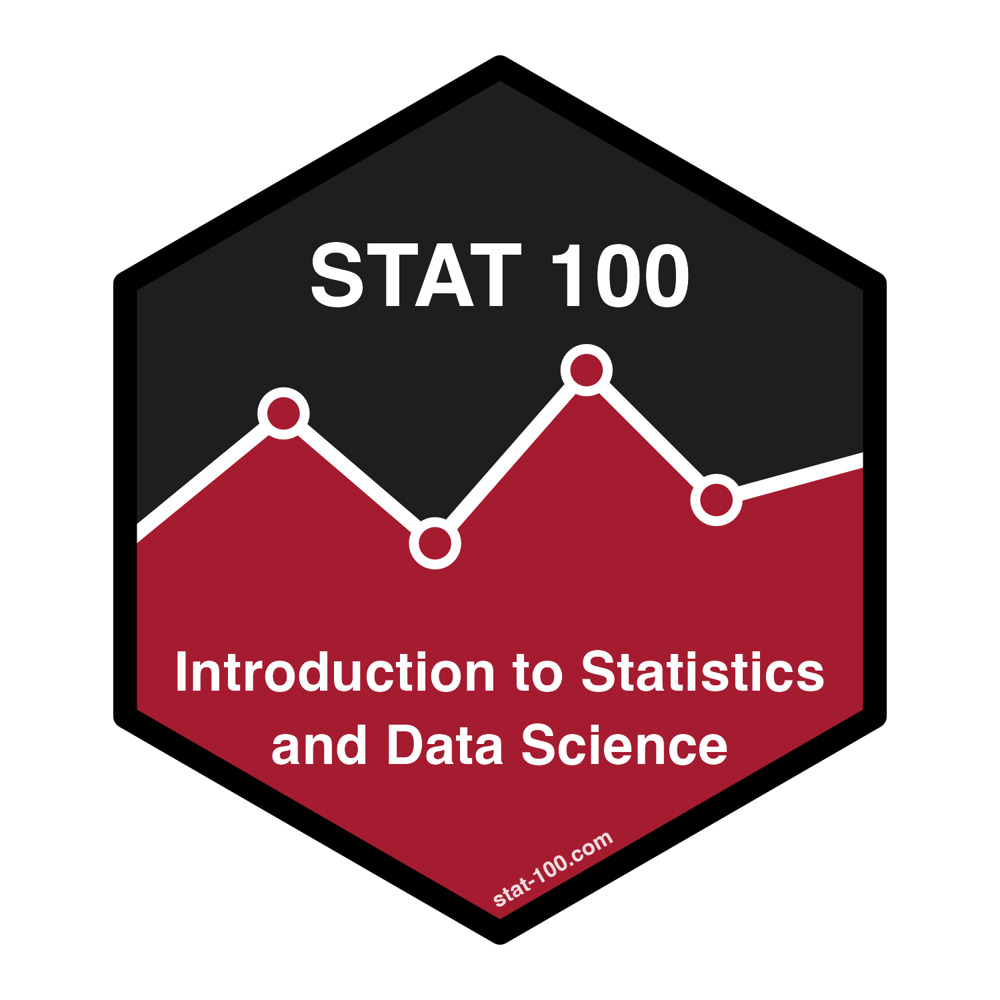

## STATS 100

  
### Introduction Statistics and Data Science 
Harvard University 

Fall 2026

[Dr. Mine Dogucu](https://minedogucu.com)  

Introduction to key ideas underlying statistical and quantitative reasoning, and the practice of data science. Course topics include methods for organizing, summarizing and visualizing data; basics of probability; elements of study design; data ethics; parameter estimation and hypothesis testing in one- and two-sample problems; regression with one or more predictors; and basic analysis of categorical data. Students will learn a reproducible workflow for analyzing data in the statistics package R. 

**Prerequisite**: No prior statistics or computing knowledge is assumed.

Course website is hosted at [stat-100.com](https://stat-100.com).

**Students** if you see anything missing or broken links please feel free to file an issue in this repo or let me know. Note that this is a public repo so if you create an issue it would be publicly be available. If you are concerned about privacy you can directly email me.

**Instructors** if you are planning to use any of the website design or resources feel free to do so but please attribute accordingly. See `LICENSE.md` for further information.

